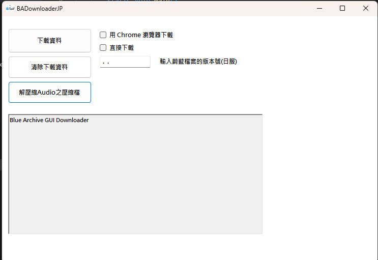

# BlueArchiveDownloaderJP
# "Blue Archive" is a registered trademark of NAT GAMES Co., Ltd. and Yostar Co., Ltd. This repository is not affiliated with NEXON Korea Corp., NEXON GAMES Co., Ltd., and Yostar Co., Ltd. All game resources are copyrighted to their respective owners.

▶️ Usage
Launch BlueArchiveGUIDownloader.exe.

Download Data

Enter the desired Version.

Select Use Chrome browser download or Direct download.

Click Download Data and confirm the prompt.

Clear Download Data

Click Clear Download Data to wipe the Downloads folder.

Decompress Audio

Click Decompress Audio to extract all encrypted audio ZIPs under Downloads/MediaResources/GameData/Audio/VOC_JP.

Monitor the ProgressBar and log box for real-time feedback.

⚙️ Configuration
All downloaded files live under the Downloads folder next to the executable.

Audio decryption passwords are generated at runtime—no hardcoded keys.

UI text is driven by the .resx resource files: Form1.resx & Form1.zh-Hant.resx.

🤝 Contributing
Fork the repo & check out a new branch.

Implement your feature or bugfix.

Submit a Pull Request against the GUI branch.

Thanks starik222 leo0215

[Releases](<https://github.com/fiseleo/BlueArchiveDownloaderJP/tree/main> "Title")
